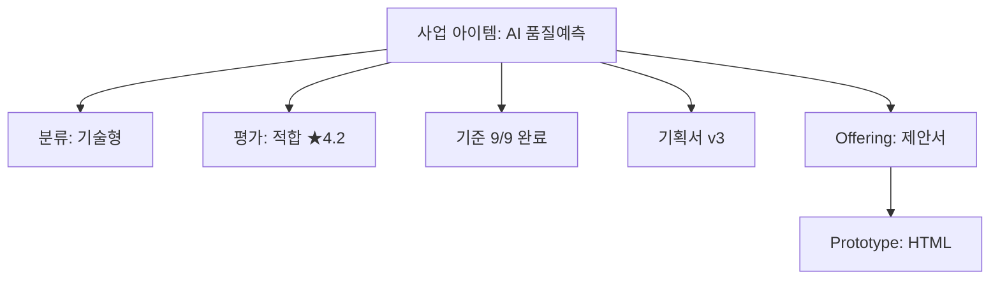

# Sprint 223: 포트폴리오 검색 API + 대시보드 시각화 설계

## Executive Summary

| 항목 | 내용 |
|------|------|
| Feature | F459 포트폴리오 연결 구조 검색 + F460 포트폴리오 대시보드 |
| Sprint | 223 |
| 핵심 전략 | 서비스 레이어에서 다중 테이블 개별 조회 + 트리 조립 / Discovery 페이지 포트폴리오 탭 + Mermaid 그래프 |
| 참조 Plan | [[FX-PLAN-S223]] |

### Value Delivered

| 관점 | 내용 |
|------|------|
| Problem | 사업 아이템의 전체 파이프라인 이력이 분산되어 있어 추적 불가 |
| Solution | 단일 API로 전체 연결 트리 조회 + 대시보드에서 진행률/연결 시각화 |
| Function UX Effect | 아이템 선택 → 전체 이력 1초 내 로딩 / 포트폴리오 전체 현황 한 화면 파악 |
| Core Value | BD 라이프사이클 투명성 — 의사결정 속도 향상 |

---

## 1. F459: 포트폴리오 연결 구조 검색 API

### 1.1 엔드포인트

```
GET /biz-items/:id/portfolio
```

**인증**: JWT 필수 (tenant 미들웨어 경유)
**권한**: org_id 일치 검증

### 1.2 DB 관계 맵

```
biz_items (1)
  ├── biz_item_classifications (1:1)
  ├── biz_evaluations (1:N)
  │     └── biz_evaluation_scores (1:N)
  ├── biz_item_starting_points (1:1)
  ├── biz_discovery_criteria (1:N, max 9)
  ├── business_plan_drafts (1:N, versioned)
  ├── offerings (1:N)
  │     ├── offering_sections (1:N)
  │     ├── offering_versions (1:N)
  │     └── offering_prototypes (M:N) ──┐
  ├── prototypes (1:N)  ◄──────────────┘
  └── pipeline_stages (1:N, 이력)
```

### 1.3 쿼리 전략

D1 환경에서 7개 이상 테이블 JOIN은 불안정하므로, **서비스 레이어에서 개별 쿼리 조립** 방식을 사용해요.

```typescript
// core/discovery/services/portfolio-service.ts

export class PortfolioService {
  constructor(private db: D1Database) {}

  async getPortfolioTree(bizItemId: string, orgId: string): Promise<PortfolioTree> {
    // 1. biz_item 기본 정보 + org_id 권한 확인
    const item = await this.getBizItem(bizItemId, orgId);
    if (!item) throw new NotFoundError("사업 아이템을 찾을 수 없어요");

    // 2. 병렬 조회 (Promise.all)
    const [
      classification,
      evaluations,
      startingPoint,
      criteria,
      businessPlans,
      offerings,
      prototypes,
      pipelineStages,
    ] = await Promise.all([
      this.getClassification(bizItemId),
      this.getEvaluations(bizItemId),
      this.getStartingPoint(bizItemId),
      this.getCriteria(bizItemId),
      this.getBusinessPlans(bizItemId),
      this.getOfferings(bizItemId),
      this.getPrototypes(bizItemId),
      this.getPipelineStages(bizItemId),
    ]);

    // 3. offering ↔ prototype 연결 (offering_prototypes)
    const offeringsWithPrototypes = await this.attachPrototypesToOfferings(offerings, prototypes);

    // 4. 트리 조립 + 진행률 계산
    return {
      item,
      classification,
      evaluations,
      startingPoint,
      criteria,
      businessPlans,
      offerings: offeringsWithPrototypes,
      prototypes,
      pipelineStages,
      progress: this.calculateProgress(pipelineStages, criteria, businessPlans, offerings, prototypes),
    };
  }
}
```

### 1.4 개별 쿼리 상세

| # | 쿼리 | 테이블 | 조건 |
|---|------|--------|------|
| 1 | getBizItem | `biz_items` | `id = ? AND org_id = ?` |
| 2 | getClassification | `biz_item_classifications` | `biz_item_id = ?` |
| 3 | getEvaluations | `biz_evaluations` JOIN `biz_evaluation_scores` | `biz_item_id = ?` |
| 4 | getStartingPoint | `biz_item_starting_points` | `biz_item_id = ?` |
| 5 | getCriteria | `biz_discovery_criteria` | `biz_item_id = ?` ORDER BY `criterion_id` |
| 6 | getBusinessPlans | `business_plan_drafts` | `biz_item_id = ?` ORDER BY `version DESC` |
| 7 | getOfferings | `offerings` LEFT JOIN `offering_sections`, `offering_versions` | `biz_item_id = ?` |
| 8 | getPrototypes | `prototypes` | `biz_item_id = ?` ORDER BY `version DESC` |
| 9 | getPipelineStages | `pipeline_stages` | `biz_item_id = ?` ORDER BY `entered_at` |
| 10 | attachPrototypesToOfferings | `offering_prototypes` | offering_id IN (?) |

### 1.5 응답 스키마

```typescript
// core/discovery/schemas/portfolio.ts
import { z } from "zod";

export const PortfolioClassificationSchema = z.object({
  itemType: z.string(),
  confidence: z.number(),
  classifiedAt: z.string(),
}).nullable();

export const PortfolioEvaluationSchema = z.object({
  id: z.string(),
  verdict: z.string(),
  avgScore: z.number(),
  totalConcerns: z.number(),
  evaluatedAt: z.string(),
  scores: z.array(z.object({
    personaId: z.string(),
    businessViability: z.number(),
    strategicFit: z.number(),
    customerValue: z.number(),
    summary: z.string().nullable(),
  })),
});

export const PortfolioStartingPointSchema = z.object({
  startingPoint: z.enum(["idea", "market", "problem", "tech", "service"]),
  confidence: z.number(),
  reasoning: z.string().nullable(),
}).nullable();

export const PortfolioCriterionSchema = z.object({
  criterionId: z.number(),
  status: z.enum(["pending", "in_progress", "completed", "needs_revision"]),
  evidence: z.string().nullable(),
  completedAt: z.string().nullable(),
});

export const PortfolioBusinessPlanSchema = z.object({
  id: z.string(),
  version: z.number(),
  modelUsed: z.string().nullable(),
  generatedAt: z.string(),
});

export const PortfolioOfferingSchema = z.object({
  id: z.string(),
  title: z.string(),
  purpose: z.enum(["report", "proposal", "review"]),
  format: z.enum(["html", "pptx"]),
  status: z.string(),
  currentVersion: z.number(),
  sectionsCount: z.number(),
  versionsCount: z.number(),
  linkedPrototypeIds: z.array(z.string()),
});

export const PortfolioPrototypeSchema = z.object({
  id: z.string(),
  version: z.number(),
  format: z.string(),
  templateUsed: z.string().nullable(),
  generatedAt: z.string(),
});

export const PortfolioPipelineStageSchema = z.object({
  stage: z.string(),
  enteredAt: z.string(),
  exitedAt: z.string().nullable(),
  notes: z.string().nullable(),
});

export const PortfolioProgressSchema = z.object({
  currentStage: z.string(),
  completedStages: z.array(z.string()),
  criteriaCompleted: z.number(),
  criteriaTotal: z.number(),
  hasBusinessPlan: z.boolean(),
  hasOffering: z.boolean(),
  hasPrototype: z.boolean(),
  overallPercent: z.number(),   // 0~100
});

export const PortfolioTreeSchema = z.object({
  item: z.object({
    id: z.string(),
    title: z.string(),
    description: z.string().nullable(),
    source: z.string(),
    status: z.string(),
    createdAt: z.string(),
  }),
  classification: PortfolioClassificationSchema,
  evaluations: z.array(PortfolioEvaluationSchema),
  startingPoint: PortfolioStartingPointSchema,
  criteria: z.array(PortfolioCriterionSchema),
  businessPlans: z.array(PortfolioBusinessPlanSchema),
  offerings: z.array(PortfolioOfferingSchema),
  prototypes: z.array(PortfolioPrototypeSchema),
  pipelineStages: z.array(PortfolioPipelineStageSchema),
  progress: PortfolioProgressSchema,
});

export type PortfolioTree = z.infer<typeof PortfolioTreeSchema>;
```

### 1.6 진행률 계산 로직

```typescript
calculateProgress(
  stages: PipelineStage[],
  criteria: Criterion[],
  plans: BusinessPlan[],
  offerings: Offering[],
  prototypes: Prototype[],
): PortfolioProgress {
  const STAGE_ORDER = ["REGISTERED", "DISCOVERY", "FORMALIZATION", "REVIEW", "DECISION", "OFFERING"];
  const currentStage = stages.length > 0
    ? stages[stages.length - 1].stage
    : "REGISTERED";

  const completedStages = STAGE_ORDER.slice(0, STAGE_ORDER.indexOf(currentStage) + 1);
  const criteriaCompleted = criteria.filter(c => c.status === "completed").length;

  // 가중치 기반 진행률 (총 100%)
  // 단계진입 30% + 기준완료 25% + 기획서 15% + Offering 15% + Prototype 15%
  const stagePercent = (completedStages.length / STAGE_ORDER.length) * 30;
  const criteriaPercent = (criteriaCompleted / 9) * 25;
  const planPercent = plans.length > 0 ? 15 : 0;
  const offeringPercent = offerings.length > 0 ? 15 : 0;
  const prototypePercent = prototypes.length > 0 ? 15 : 0;

  return {
    currentStage,
    completedStages,
    criteriaCompleted,
    criteriaTotal: 9,
    hasBusinessPlan: plans.length > 0,
    hasOffering: offerings.length > 0,
    hasPrototype: prototypes.length > 0,
    overallPercent: Math.round(stagePercent + criteriaPercent + planPercent + offeringPercent + prototypePercent),
  };
}
```

### 1.7 라우트 등록

```typescript
// core/discovery/routes/biz-items.ts 에 추가

bizItemsRoute.get("/biz-items/:id/portfolio", async (c) => {
  const orgId = c.get("orgId");
  const bizItemId = c.req.param("id");

  const service = new PortfolioService(c.env.DB);
  const portfolio = await service.getPortfolioTree(bizItemId, orgId);

  return c.json({ data: portfolio });
});
```

### 1.8 에러 처리

| HTTP | 조건 | 응답 |
|------|------|------|
| 404 | biz_item 미존재 또는 org_id 불일치 | `{ error: "사업 아이템을 찾을 수 없어요" }` |
| 500 | DB 쿼리 오류 | `{ error: "포트폴리오 조회 중 오류가 발생했어요" }` |

---

## 2. F460: 포트폴리오 대시보드

### 2.1 UI 구조

```
/ax-bd/discovery
├── [탭] 아이템 목록 (기존)
└── [탭] 포트폴리오 (신규 F460)
       ├── 필터 바 (상태별, 단계별)
       ├── 아이템 카드 리스트
       │     ├── 제목 + 상태 배지
       │     ├── PipelineProgressBar (6단계)
       │     └── 문서 카운트 요약 (기획서 N건, Offering N건, Prototype N건)
       └── [선택 시] PortfolioGraph (연결 시각화)
```

### 2.2 PortfolioView 컴포넌트

```typescript
// components/feature/discovery/PortfolioView.tsx

interface PortfolioViewProps {
  orgId: string;
}

export default function PortfolioView({ orgId }: PortfolioViewProps) {
  const [items, setItems] = useState<PortfolioSummaryItem[]>([]);
  const [selectedId, setSelectedId] = useState<string | null>(null);
  const [portfolio, setPortfolio] = useState<PortfolioTree | null>(null);
  const [filter, setFilter] = useState<string>("all");

  // 1. 아이템 목록 + summary 조회 (기존 /biz-items/summary 재사용)
  // 2. 아이템 선택 시 /biz-items/:id/portfolio 호출
  // 3. 필터: all | REGISTERED | DISCOVERY | FORMALIZATION | REVIEW | DECISION | OFFERING
}
```

### 2.3 PipelineProgressBar 컴포넌트

```typescript
// components/feature/discovery/PipelineProgressBar.tsx

interface PipelineProgressBarProps {
  currentStage: string;
  completedStages: string[];
  overallPercent: number;
}

// 렌더링:
// ●─────●─────●─────○─────○─────○  67%
// 등록    발굴   형상화  검토   결정   오퍼링
```

**구현 포인트**:
- 6개 스텝 아이콘 (완료=filled, 현재=pulse, 미래=empty)
- 기존 `STAGES` 상수 (`dashboard.tsx`)와 동일한 순서 사용
- 진행률 퍼센트 텍스트 우측 표시
- 컬러: 완료=`bg-green-500`, 현재=`bg-blue-500`, 미래=`bg-muted`

### 2.4 PortfolioGraph 컴포넌트

```typescript
// components/feature/discovery/PortfolioGraph.tsx

interface PortfolioGraphProps {
  portfolio: PortfolioTree;
}
```

**렌더링 전략**: Mermaid flowchart 기반 (향후 커스텀 SVG 전환 가능).



**구현 방식**:
- `portfolio.item` → 루트 노드
- 각 하위 데이터 존재 여부에 따라 노드 동적 생성
- Mermaid CDN (`<script src="mermaid.min.js">`) 또는 `mermaid` npm 패키지 사용
- 노드 클릭 시 해당 상세 페이지로 라우팅 (e.g., Offering → `/ax-bd/shaping/:id`)

### 2.5 Discovery 탭 추가

```typescript
// routes/ax-bd/discovery.tsx 수정

// 기존: 아이템 목록만 표시
// 변경: Tabs 컴포넌트로 감싸서 2탭 구성

<Tabs defaultValue="list">
  <TabsList>
    <TabsTrigger value="list">아이템 목록</TabsTrigger>
    <TabsTrigger value="portfolio">포트폴리오</TabsTrigger>
  </TabsList>
  <TabsContent value="list">
    {/* 기존 아이템 목록 */}
  </TabsContent>
  <TabsContent value="portfolio">
    <PortfolioView orgId={orgId} />
  </TabsContent>
</Tabs>
```

### 2.6 대시보드 파이프라인 카운트 연동

현재 `routes/dashboard.tsx`의 파이프라인 섹션은 `PipelineStats` 타입으로 `byStage` 카운트를 표시하지만, 실제 API 호출이 연결되지 않아 카운트가 0이에요.

```typescript
// dashboard.tsx 수정

// 기존: PipelineStats 하드코딩 또는 빈 데이터
// 변경: /biz-items/summary API 활용하여 실제 stage별 카운트 표시

const summary = useApi<BizItemSummary[]>("/biz-items/summary");

// summary → byStage 변환
const byStage = useMemo(() => {
  if (!summary.data) return {};
  const counts: Record<string, number> = {};
  for (const item of summary.data) {
    const stage = item.stage || "REGISTERED";
    counts[stage] = (counts[stage] || 0) + 1;
  }
  return counts;
}, [summary.data]);
```

### 2.7 API Client 추가

```typescript
// lib/api-client.ts 에 추가

export async function fetchPortfolio(bizItemId: string): Promise<PortfolioTree> {
  return fetchApi<PortfolioTree>(`/biz-items/${bizItemId}/portfolio`);
}

export interface PortfolioTree {
  item: { id: string; title: string; description: string | null; source: string; status: string; createdAt: string };
  classification: { itemType: string; confidence: number; classifiedAt: string } | null;
  evaluations: Array<{
    id: string; verdict: string; avgScore: number; totalConcerns: number; evaluatedAt: string;
    scores: Array<{ personaId: string; businessViability: number; strategicFit: number; customerValue: number; summary: string | null }>;
  }>;
  startingPoint: { startingPoint: string; confidence: number; reasoning: string | null } | null;
  criteria: Array<{ criterionId: number; status: string; evidence: string | null; completedAt: string | null }>;
  businessPlans: Array<{ id: string; version: number; modelUsed: string | null; generatedAt: string }>;
  offerings: Array<{
    id: string; title: string; purpose: string; format: string; status: string;
    currentVersion: number; sectionsCount: number; versionsCount: number; linkedPrototypeIds: string[];
  }>;
  prototypes: Array<{ id: string; version: number; format: string; templateUsed: string | null; generatedAt: string }>;
  pipelineStages: Array<{ stage: string; enteredAt: string; exitedAt: string | null; notes: string | null }>;
  progress: {
    currentStage: string; completedStages: string[];
    criteriaCompleted: number; criteriaTotal: number;
    hasBusinessPlan: boolean; hasOffering: boolean; hasPrototype: boolean;
    overallPercent: number;
  };
}
```

---

## 3. 테스트 전략

### 3.1 API 테스트 (F459)

| # | 테스트 케이스 | 검증 |
|---|-------------|------|
| 1 | 전체 연결 데이터가 있는 아이템 조회 | classification, evaluations, criteria, businessPlans, offerings, prototypes 모두 반환 |
| 2 | 하위 데이터 없는 아이템 조회 | 빈 배열/null 반환, 에러 없음 |
| 3 | 존재하지 않는 아이템 ID | 404 반환 |
| 4 | 다른 org의 아이템 접근 시도 | 404 반환 (권한 차단) |
| 5 | progress 계산 정확도 | criteria 5/9 완료 + plan 있음 + offering 없음 → 예상 퍼센트 검증 |

**테스트 fixture**: `mock-d1.ts` 헬퍼 사용하여 biz_items, classifications, evaluations, criteria, business_plan_drafts, offerings, prototypes, pipeline_stages 각 1건 이상 seed.

### 3.2 Web 테스트 (F460)

| # | 테스트 케이스 | 검증 |
|---|-------------|------|
| 1 | PortfolioView 렌더링 | 아이템 목록 + 진행률 바 표시 |
| 2 | PipelineProgressBar | currentStage="FORMALIZATION" → 3개 filled, 3개 empty |
| 3 | 탭 전환 | "포트폴리오" 탭 클릭 → PortfolioView 렌더링 |
| 4 | 빈 데이터 | 아이템 0건 → 빈 상태 안내 메시지 |

---

## 4. 검증 기준 (Gap Analysis 대응)

| # | Design 항목 | 검증 방법 | Pass 기준 |
|---|------------|----------|----------|
| D1 | Portfolio API 응답 | `portfolio-route.test.ts` | 10개 필드 정확 반환 |
| D2 | 진행률 계산 | `portfolio-service.test.ts` | 가중치 공식 일치 |
| D3 | 병렬 쿼리 | 서비스 코드 `Promise.all` 확인 | 8개 쿼리 병렬 실행 |
| D4 | 포트폴리오 탭 | discovery.tsx Tabs 존재 | "포트폴리오" TabsTrigger |
| D5 | PipelineProgressBar | 컴포넌트 테스트 | 6단계 렌더링 + 올바른 색상 |
| D6 | PortfolioGraph | Mermaid 또는 커스텀 SVG | 루트 노드 + 하위 노드 존재 |
| D7 | 대시보드 카운트 | dashboard.tsx byStage | 0이 아닌 실제 수치 표시 |
| D8 | typecheck + lint | `turbo typecheck lint` | 0 에러 |
| D9 | 전체 테스트 | `turbo test` | 0 실패 |
