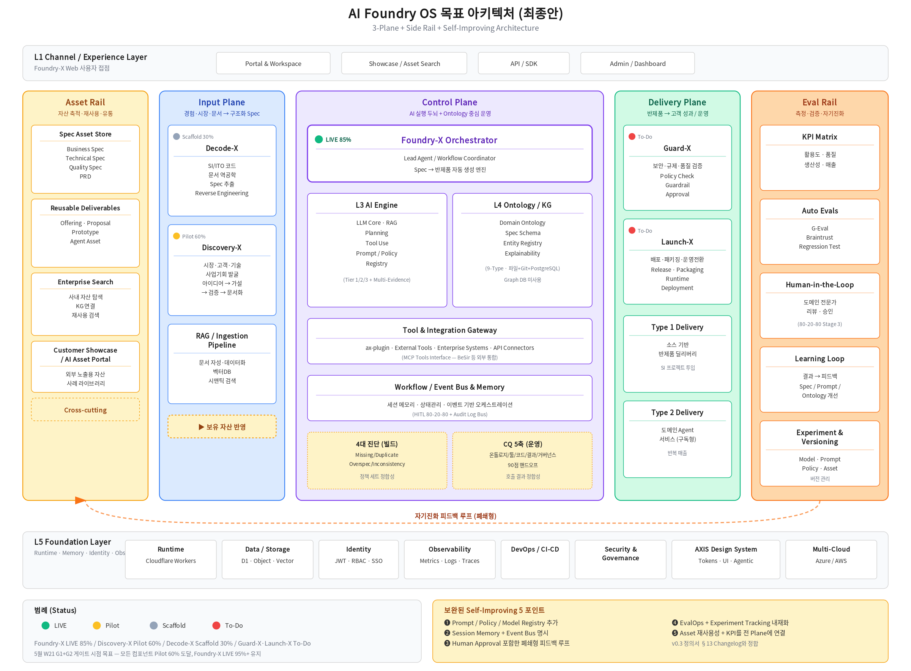

# AI Foundry — Phase 1 (~5월) 기획 확정 로드맵 v2

> **v2 갱신**: BeSir 정합성 분석(06 문서) + 통합 모델 인터뷰(Q4·Q5) 결과 반영. v1 대비 통합 방향(MCP)·노드 모델(9타입)·검증 체계(4대 진단+CQ 이층) 추가.

## 1. 한 문장 정의

> **AI Foundry는 기업의 의사결정을 자산으로 만드는 Agentic AI 플랫폼입니다.**

기업 내 휘발되는 의사결정의 **근거·맥락·일관성**을 5-Layer 아키텍처로 처리하여, **5가지 영구 자산**(Policy Pack · Ontology · Skill Package · Decision Log · System Knowledge)으로 영구화하여 조직 IP로 축적합니다. **외부 한 줄**: "당신 조직의 critical 정책 충돌을 30일 안에 다 찾고, 감독 응답 시간을 일주일 → 즉시로 줄입니다."

## 2. 본 보고의 결재 안건 5건 (W18)

| # | 안건 | 결재 필요성 |
|---|---|---|
| **A** | **5 모듈 코어 인력 지정** (Layer 1~5 각 1명) — 50%+ 시간 확보 | Phase 2(6월 Prototype) 착수 전제. 미지정 시 8월 사업 적용 도미노 지연 |
| **B** | **첫 도메인 후보 short list 1순위** (HR · Ops · 심사·승인 중) | Phase 3(8월) 진입 게이트(G4) 7월 W29 통과를 위해 5월 W22 이전 윤곽 필요 |
| **C** | **Prototype 범위 축소 fallback 정책** 사전 합의 (Green/Yellow/Red 3단계) | "범위 축소 ≠ 실패" 공감대 — 6월 일정 보호용 |
| **D** | **AI Foundry 정의서 v0.3 → v1.0 sign-off** (W21 G1+G2) | Phase 2 착수 결재 |
| **E (v2 신규)** | **BeSir과 MCP 표준 인터페이스 통합 합의** | 5월 W19 차기 미팅 사전 합의. 자체 엔진(X1) + BeSir 도구 부분 차용 |

## 3. AI Foundry 5-Layer 아키텍처 (외부용)

| Layer | 정의 | v0.3 핵심 |
|---|---|---|
| Layer 1 Data | 비정형/정형 입력 → 표준화 | Interview Connector 신규 |
| Layer 2 Ontology | 사람을 복제하는 시멘틱 레이어 (현행만) | **9타입** (Domain·Fact·Dimension·Workflow·Event·Actor·Policy·Support·Decision) — Graph DB 미사용, 파일+Git+PostgreSQL |
| Layer 3 LLM | Tier 1/2/3 라우팅 + Multi-Evidence | E1·E2·E3 가중 신뢰도 |
| Layer 4 Workflow | HITL 80-20-80 + 4대 진단 + audit log | 5 RBAC + Browser Console |
| Layer 5 Agent | Skill Package + MCP Tools Interface | BeSir 등 외부 통합 (Q1 결정 — MCP) |

## 4. 5월 마일스톤 (W18~W21)

| 주차 | 일정 | 핵심 액션 (Owner) | 산출물 |
|---|---|---|---|
| **W18** (5/4~10) | 합의 라운드 시작 | • AXBD 임원·코어 후보에 v0.3 공유 + 1:1 사전 협의 (Sinclair) • **5 모듈 코어 인력 지정 결재** 요청 • **06 BeSir 분석 문서 BeSir·서민원에 사전 회람** (NDA 후) | 의사록 + 인력 명단 |
| **W19** (5/11~17) | 모듈 스펙 + **BeSir 차기 미팅** | • 5-Layer 모듈 스펙 v0.1 작성 • 가상 도메인 1·2 데이터 사양 • **BeSir 차기 미팅** (5월 11~15일 사이, 90분) — MCP 통합 합의 | spec drafts + 미팅 의사록 |
| **W20** (5/18~24) | 기술 스택 선정 | • LLM 공급자 선정 • PostgreSQL + Git 저장소 인프라 결정 (Graph DB 대체) • 인터페이스 카탈로그 v0.1 검토 | 공급자 결정 |
| **W21** (5/25~31) | **G1+G2 통합 게이트** | • 정의서 v0.3 → v1.0 임원 sign-off • Phase 2 인력 50%+ 시간 확보 점검 • 모듈 스펙 v1.0 합의 | **Phase 2 착수 결재** |

> **Critical Path Warning** — W18 인력 지정 또는 W19 BeSir 미팅 또는 W21 v1.0 합의 실패 시 6월 Prototype·8월 사업 적용 도미노 지연.

## 5. 통합 모델 결정 (BeSir 인터뷰 결과, 2026-04-30)

| Q | 결정 | 함의 |
|---|---|---|
| **Q1 통합 방향** | **C. MCP 표준 인터페이스** (느슨한 연동) | AI Foundry·BeSir 모두 독립 제품 유지, 양방향 MCP Tools 연동 |
| **Q2 AI Foundry 위상** | **X1 자체 엔진 + BeSir 도구 부분 차용** | 온톨로지 코어는 KTDS 자산, BeSir 파트너 도구(Code Agent·System Analyzer·DB Connect)는 옵션 |
| **Q3 노드 모델** | **9타입** (BeSir 7 + Domain + Decision) | 자산 호환성 확보, Dimension 신규 |
| **Q4 검증 체계** | **4대 진단 메인 + CQ 보조** | 4대 진단(빌드 단계) + CQ 5축(운영 단계) 이층 분리 |

## 6. 5월에 답을 받아야 하는 핵심 가설 4건 (H1~H4)

| 가설 | 점검 시점 | 깨질 시 영향 |
|---|---|---|
| H1 (합의) 5월 안 시스템 정의·자산화 합의 가능 | W18·W21 | Phase 2 1주 지연 |
| H2 (기술) 6월 한 달 7.3 FTE로 Prototype 가능 | W21 | §7.6.1 fallback 발동 (시그니처 축소) |
| H3 (사업) 7월 G4 전 KT 본부와 실제 도메인 1개 윤곽 | W22 이전 | 8월 사업 적용 메시지 약화 |
| **H4 (v2 신규)** **BeSir과 MCP 표준 합의** | W19 미팅 | Phase 4 자산 재사용 가속화 가설 약화 |

## 7. 결재 후 즉시 진행 (5월 W22 이후)

- **6월 4주**: Phase 2 Prototype α1~α4 + MCP Tools 5개 가동 + 가상 도메인 E2E → G3 통과
- **7월 4주**: Phase 3 진입 정비 (도메인·NDA·인력) → G4 통과
- **8월 4주**: 첫 실제 도메인 정책팩 v1.0 운영 시작 → G5 통과 + **임원 종합 보고**

## 8. 본 보고에서 결정해주실 것

- **A·B·C·D·E 5건의 결재**
- **본 정의서 v0.3 (BeSir 정합성 P0 10건 반영)** sign-off
- **5월 W19 BeSir 차기 미팅 일정 확정** (5월 11~15일 중)

> 정의서 v0.3 본문(100KB · ~45쪽), 06 BeSir 분석 문서(28KB), 사내 운영 아키텍처 PNG 시각화는 모두 즉시 회람 가능.

— Sinclair Seo / 서민원 / 2026-04-30

---

## 부록 — 사내 운영 아키텍처 (참고용, 외부 회람 X)

> KTDS-AXBD 사내 운영 자산(Foundry-X · Decode-X · Discovery-X · ax-plugin · AXIS-DS)을 포함한 3-Plane + Side Rail 그림. 임원 보고용 참고. 외부 회람 시에는 §3의 추상 5-Layer 사용.

상세 설명: `07_ai_foundry_os_target_architecture.md` 또는 `.docx`
